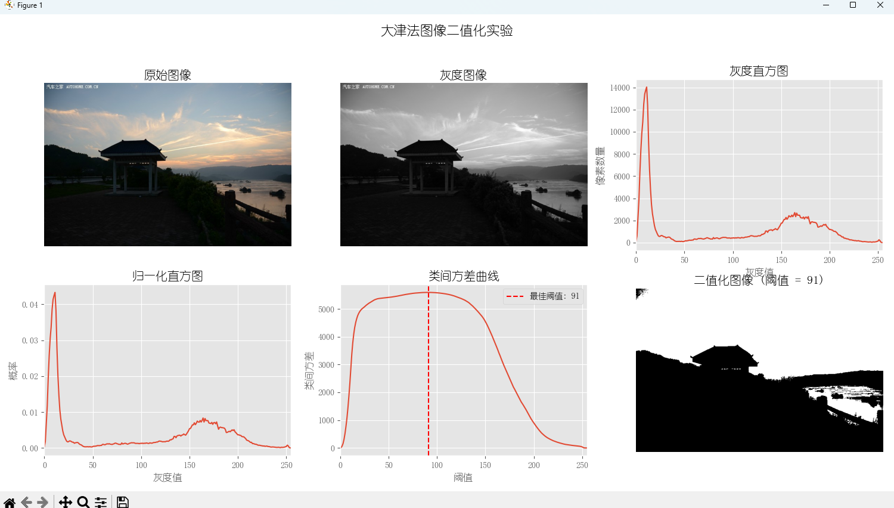

# 实验四、基于大津法（OTSU算法）的图像二值化

## 一、实验目的

1. 掌握大津法（OTSU算法）的基本数学原理及其在图像分割中的应用。
2. 熟悉图像二值化的流程，包括颜色空间转换、直方图统计与阈值选择。
3. 通过编程实践，理解自动阈值分割的实现过程。

## 二、实验原理

### 1. 颜色空间变换

在图像处理中，RGB彩色图像通常需要转换为灰度图像以简化处理过程。灰度化使用的标准公式为：
```
Y = 0.299R + 0.587G + 0.114B
```
其中R、G、B分别表示红、绿、蓝三个颜色通道的值，Y为转换后的灰度值。

在本实验中，我们使用OpenCV的`cv2.cvtColor()`函数，通过`cv2.COLOR_BGR2GRAY`参数实现RGB到灰度的转换。

### 2. 直方图统计

灰度直方图是图像中各灰度级像素数量的统计图，横轴表示灰度值（0~255），纵轴表示相应灰度值的像素数量。通过直方图可以直观了解图像的灰度分布情况。

归一化直方图表示每个灰度值的概率分布，计算公式为：
```
p(i) = h(i) / N
```
其中h(i)是灰度值为i的像素数量，N是图像总像素数。

### 3. 大津法原理

大津法（OTSU算法）是一种自适应阈值确定方法，其核心思想是最大化类间方差。该方法假设图像包含前景和背景两个类别，通过遍历所有可能的阈值T，计算前景和背景的类间方差，选择使类间方差最大的阈值作为最佳分割阈值。

计算过程如下：

1) 对于阈值T，将图像分为两类：C0（背景，灰度值≤T）和C1（前景，灰度值>T）
2) 计算C0和C1的像素占比：w0和w1
3) 计算C0和C1的平均灰度值：μ0和μ1
4) 计算类间方差：σB² = w0 × w1 × (μ0 - μ1)²
5) 选择使σB²最大的阈值T作为最佳阈值

### 4. 二值化处理

根据确定的最佳阈值T，图像二值化的规则为：
- 若像素灰度值 ≥ T，则像素值设为255（白色，前景）
- 若像素灰度值 < T，则像素值设为0（黑色，背景）

## 三、实验步骤

1. **读取图像并转换为灰度图**
   - 使用`cv2.imread()`读取图像
   - 使用`cv2.cvtColor()`将RGB图像转换为灰度图

2. **计算灰度直方图**
   - 使用`cv2.calcHist()`计算原始直方图
   - 归一化直方图得到概率分布

3. **大津法计算最佳阈值**
   - 忽略灰度频率低于10的灰度值，避免噪声干扰
   - 遍历有效灰度范围，计算每个阈值T的类间方差σB²
   - 找出使类间方差最大的阈值T*

4. **图像二值化**
   - 使用最佳阈值T*对灰度图进行二值化处理

5. **可视化结果**
   - 显示原图、灰度图、直方图、类间方差曲线及二值化结果

## 四、核心代码实现

### 1. 大津法阈值计算

```python
def 大津法计算阈值(gray_img, hist_counts):
    """使用大津法计算最佳阈值"""
    total_pixels = gray_img.shape[0] * gray_img.shape[1]
    normalized_hist = hist_counts / total_pixels
    
    max_sigma_b_squared = -1
    optimal_threshold = 0
    sigma_b_squared_values = np.zeros(256)
    
    # 忽略灰度频率低于10的灰度值
    valid_bins = np.where(hist_counts >= 10)[0]
    if len(valid_bins) == 0:
        min_gray_level = 0
        max_gray_level = 255
    else:
        min_gray_level = valid_bins[0]
        max_gray_level = valid_bins[-1]
    
    # 遍历所有可能的阈值T
    for t in range(min_gray_level, max_gray_level + 1):
        # 背景 (灰度值 <= t)
        w0 = np.sum(normalized_hist[0:t+1])
        if w0 > 0:
            mu0 = np.sum(np.arange(0, t+1) * normalized_hist[0:t+1]) / w0
        else:
            mu0 = 0
        
        # 前景 (灰度值 > t)
        w1 = np.sum(normalized_hist[t+1:256])
        if w1 > 0:
            mu1 = np.sum(np.arange(t+1, 256) * normalized_hist[t+1:256]) / w1
        else:
            mu1 = 0
        
        # 类间方差 σB² = w0 * w1 * (μ0 - μ1)²
        sigma_b_squared = w0 * w1 * ((mu0 - mu1) ** 2)
        sigma_b_squared_values[t] = sigma_b_squared
        
        if sigma_b_squared > max_sigma_b_squared:
            max_sigma_b_squared = sigma_b_squared
            optimal_threshold = t
    
    return optimal_threshold, sigma_b_squared_values
```

### 2. 图像二值化

```python
def 二值化图像(gray_img, threshold):
    """根据阈值对图像进行二值化"""
    # 灰度值 >= threshold 的像素设为255（白色，前景）
    # 灰度值 < threshold 的像素设为0（黑色，背景）
    binary_img = np.where(gray_img >= threshold, 255, 0).astype(np.uint8)
    return binary_img
```

## 五、实验结果与分析

### 1. 实验结果展示


### 2. 结果分析

#### 大津法的有效性
通过观察类间方差曲线，可以看到一个明显的峰值，对应于最佳阈值T*。在测试图像上，大津法能够有效地区分前景和背景，特别是在图像的直方图呈现双峰分布时。

#### 与OpenCV内置OTSU的对比
程序输出了自己实现的大津法和OpenCV内置OTSU方法的阈值对比：
```
大津法计算的最佳阈值为: 91
OpenCV OTSU计算的阈值为: 91
```
通常两者结果非常接近，这验证了我们实现的正确性。

#### 参数调整实验
调整直方图有效范围的阈值（原本为10）可以观察到：
- 阈值过低：受噪声影响增大，可能导致分割结果不稳定
- 阈值过高：可能忽略有意义的灰度区域，导致信息丢失

## 六、思考题解答

### 1. 算法分析

**问：大津法假设图像的直方图具有双峰性。若直方图为单峰或多峰，该方法是否仍然有效？为什么？**

答：大津法在直方图为双峰时效果最佳，因为此时前景和背景的区分较为明显。当直方图为单峰时，大津法可能不能给出理想的分割结果，因为前景和背景的区分不明显。对于多峰直方图，大津法只能找到一个全局阈值，无法处理多个阈值的情况，这可能导致某些区域的分割不理想。此时可能需要使用多阈值分割方法或局部自适应阈值方法。

**问：类间方差最大化与类内方差最小化有何联系？试从数学角度解释。**

答：对于图像的总方差σT²，有：σT² = σW² + σB²，其中σW²是类内方差，σB²是类间方差。由于σT²是固定的（由图像本身决定），因此最大化类间方差σB²等价于最小化类内方差σW²。这就是大津法的数学原理 - 通过最大化类间方差来间接最小化类内方差，从而获得最佳分割效果。

### 2. 实践改进

**问：如何优化代码中的循环计算以提高效率？**

答：可以通过向量化操作代替循环来提高效率。例如：
1. 使用累积和预计算各灰度级的像素数和灰度总和
2. 使用NumPy的广播机制并行计算所有阈值的类间方差
3. 可以只计算有效灰度范围内的阈值，避免不必要的计算

**问：若图像光照不均，大津法可能失效。请提出一种改进策略。**

答：对于光照不均的图像，可以采用以下改进策略：
1. 图像预处理：使用直方图均衡化或自适应直方图均衡化（CLAHE）改善图像对比度
2. 局部自适应阈值：将图像分为若干小区域，在每个区域内分别应用大津法
3. 结合形态学操作：在二值化后使用形态学操作（如开闭运算）处理光照不均带来的噪点或空洞

### 3. 对比实验

**问：手动选择阈值与自动选择阈值的优缺点是什么？列举实际应用场景。**

答：
- **手动选择阈值**
  - 优点：可以根据具体应用需求和先验知识调整阈值；结果更可控
  - 缺点：需要人工干预；不适合批处理；不适应图像变化
  - 应用场景：特定对象的提取；需要高精度控制的医学图像处理；艺术效果处理

- **自动选择阈值**
  - 优点：自适应性强；适合批处理；无需人工干预
  - 缺点：对复杂图像可能不如人工判断准确；依赖于算法假设
  - 应用场景：工业视觉检测；文档图像处理；大批量图像处理；实时图像分析系统

## 七、总结

本实验实现了基于大津法的图像二值化算法，通过最大化类间方差自动确定最佳阈值。实验结果表明，大津法在处理对比度较好的图像时表现良好，能够有效分离前景和背景。实验也探讨了大津法的局限性，包括对单峰直方图和光照不均图像的适应性问题，并提出了相应的改进策略。